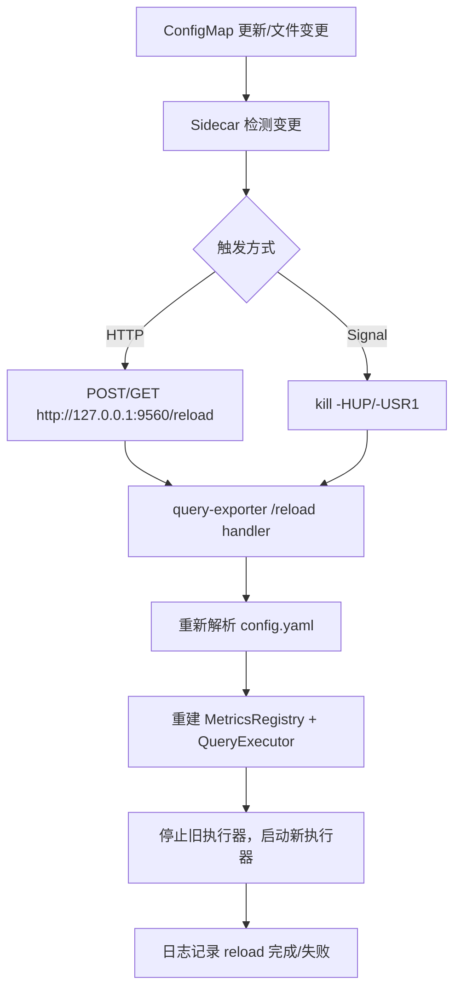

# query-exporter 热加载指南

## 能力概述
- 目标：配置变更后无需重启 Pod/Deployment 即可生效。
- 触发方式：
  - HTTP：`GET/POST /reload`（默认端口 `9560`，返回 `{"success": bool, "message": str}`）。
  - 信号：`SIGHUP` 或 `SIGUSR1` 发送给主进程 PID；可用 `--pid-file`/`QE_PID_FILE` 让进程写 PID。
- 失败回退：新配置解析或应用失败时返回非 2xx，保持旧配置运行。

## 流程图（Mermaid）


## 关键代码位置
- `query_exporter/main.py`
  - `QueryExporterScript._handle_reload`：HTTP `/reload` 入口。
  - `_perform_reload`：串行加锁，校验并重建 `MetricsRegistry` 与 `QueryExecutor`，失败保留旧配置。
  - `_install_signal_handlers`：注册 `SIGHUP` / `SIGUSR1` 到 reload。
  - `_write_pid_file`：按需写入 PID 供 sidecar 使用。
  - `_register_reload_routes`：注册 HTTP 路由。

## 部署要点（Kubernetes）
1) ConfigMap
   - 将 `config.yaml` 以 `subPath` 挂载到 `/etc/query-exporter/config.yaml`。
2) 主容器
   - 启动参数示例：
     - `--config=/etc/query-exporter/config.yaml`
     - `--pid-file=/var/run/query-exporter.pid`（供信号模式可选）
   - 挂载：
     - ConfigMap 卷到 `/etc/query-exporter/config.yaml`（`subPath: config.yaml`）
     - `emptyDir` 到 `/var/run`（存放 PID 文件）
3) Sidecar 方案（任选其一）
   - HTTP：`jimmidyson/configmap-reload` 或 `stakater/reloader`
     - 参数示例：`--volume-dir=/etc/query-exporter` `--webhook-method=POST` `--webhook-url=http://127.0.0.1:9560/reload`
     - 共享同一 ConfigMap 卷。
   - Signal：在变更时执行 `kill -HUP $(cat /var/run/query-exporter.pid)`
4) 验证
   - `curl -XPOST http://127.0.0.1:9560/reload` 查看返回。
   - 观察日志：`reload requested` / `reload completed` / 错误信息。

## 本地/容器快速使用
```bash
query-exporter \
  --config /etc/query-exporter/config.yaml \
  --pid-file /var/run/query-exporter.pid

# 触发 HTTP reload
curl -XPOST http://127.0.0.1:9560/reload

# 触发信号 reload
kill -HUP "$(cat /var/run/query-exporter.pid)"
```

## 注意事项
- Reload 是串行的；并发触发时后续请求会看到 “reload already in progress”。
- 新配置必须可解析且校验通过；否则保持旧运行态。
- 如果在不支持信号的环境（如部分容器运行时）无法安装 signal handler，可仅使用 HTTP 方式。


